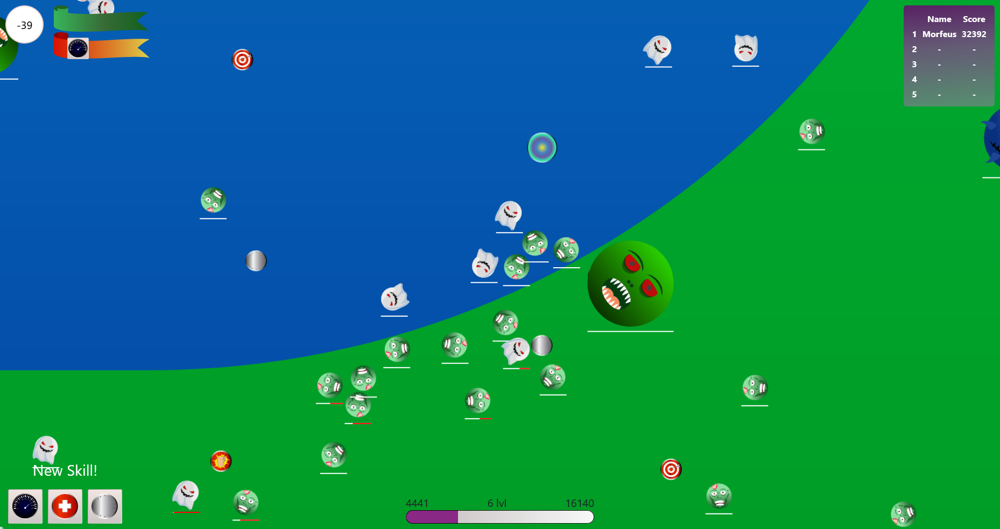

<h1 align="center">Qventio</h1>
<h4 align="center">
  <p>Шутер, созданный с помощью Canvas</p>
  
</h4>

## Development

```bash
$ npm install
$ npm run develop
```

## Production

```bash
$ npm install
$ npm run build
$ npm start
```

=======
